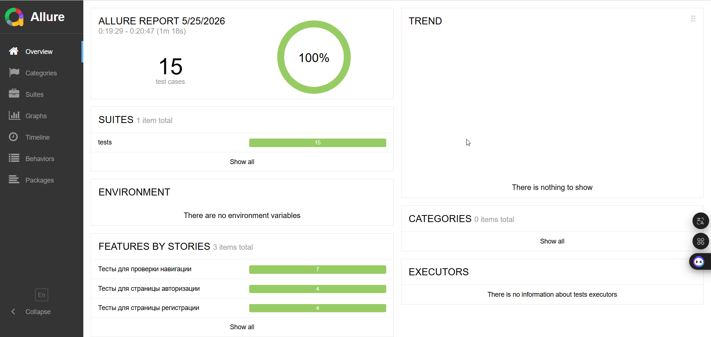

# UI Automation Project: Stellar Burgers

Проект автоматизации тестирования пользовательского интерфейса (UI) для сервиса **Stellar Burgers**. Тесты написаны на Python с использованием Selenium WebDriver и следуют паттерну проектирования Page Object Model (POM).

## Структура проекта

*   **config/** — конфигурационные файлы и управление окружениями (`environments.py`).
*   **pages/** — описание страниц и их элементов (Page Objects):
    *   `base_page.py` — базовые методы для работы с элементами.
    *   `login_page.py`, `registration_page.py` и др. — логика конкретных страниц.
*   **tests/** — тестовые сценарии, разделенные по функциональности (логин, навигация, конструктор).
*   **allure-results/** — папка с результатами прогонов для генерации отчетов.
*   **conftest.py** — настройки Pytest и фикстуры для инициализации драйвера.
*   **Dockerfile** & **docker-compose.yml** — конфигурация для запуска тестов в Docker-контейнере.
*   **pytest.ini** — общие настройки фреймворка Pytest.
*   **requirements.txt** — список зависимостей проекта.

## 🛠 Технологический стек

*   **Python 3.9**
*   **Pytest** (фреймворк для тестирования)
*   **Selenium WebDriver** (управление браузером)
*   **Docker** (контейнеризация)
*   **Allure** (отчетность)

## Запуск тестов

### 1. Запуск через Docker (рекомендуется)
Для запуска тестов в изолированной среде со всеми предустановленными зависимостями и драйверами выполните:

```bash
# Собрать образ
docker-compose up --build
# Запустить smoke‑тесты с браузером Chrome 
docker-compose run stellar-burgers pytest -m smoke --browser=chrome
```

В `docker-compose.yml` настроены переменные окружения для управления запуском:
*   `BROWSER`: выбор браузера.
*   `HEADLESS`: режим запуска (true/false).
*   `ENV`: выбор стенда (`dev` или `stage`).

### 2. Локальный запуск
Если вы хотите запустить тесты вне контейнера:

1. Создайте и активируйте виртуальное окружение:
   ```bash
   python -m venv .venv
   source .venv/bin/activate  # Для macOS/Linux
   .venv\Scripts\activate     # Для Windows
   ```
2. Установите зависимости:
   ```bash
   pip install -r requirements.txt
   ```
3. Запустите тесты:
   ```bash
   pytest
   ```

## Отчетность

После завершения тестов в папке `allure-results` появятся данные (в том числе после прогона в Docker контейнере). Чтобы просмотреть красивый графический отчет, выполните:

```bash
allure serve allure-results
```

# 📊 Пример Allure‑отчёта




# CI/CD

Проект использует **GitHub Actions** для автоматического запуска тестов и публикации Allure‑отчёта на **GitHub Pages**.

### Триггер

Workflow запускается при создании Pull Request в ветку `main`.

### Что делает pipeline

| Джоба | Описание |
|-------|----------|
| `run-tests` | Запускает тесты через `docker compose up`, генерирует Allure‑отчёт и сохраняет его как артефакт сборки. |
| `prepare-pages` | Загружает артефакт с отчётом и подготавливает его для деплоя на GitHub Pages. |
| `deploy-to-pages` | Публикует отчёт на GitHub Pages и возвращает URL. |

### Как посмотреть отчёт

1. После завершения workflow перейдите в **Settings** → **Pages** вашего репозитория.
2. Там будет указана ссылка на опубликованный сайт (например, `https://<username>.github.io/<repo>/`).
3. Отчёт автоматически обновляется при каждом успешном запуске тестов.

### Настройка GitHub Pages (один раз)

Чтобы деплой работал, в настройках репозитория (`Settings` → `Pages`) выберите источник **"GitHub Actions"**. После первого запуска всё настроится автоматически.
